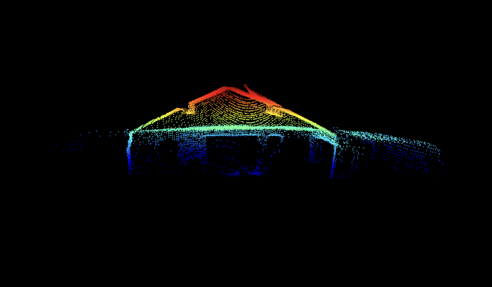

# Photoberry

A LiDAR point-cloud scanner built on a Raspberry Pi Zero 2 W. A pan/tilt gimbal sweeps a
TF-Luna rangefinder across a hemisphere while a BMI088 IMU measures the head's true
orientation against gravity. Output loads directly into CloudCompare, MeshLab, or Blender.

Intended for drone mounting and aerial scans. An ongoing project.

## Hardware

| Part | Interface | Address / Pins | Supply |
|---|---|---|---|
| TF-Luna LiDAR | I²C bus 1 | `0x10` | **5 V** |
| BMI088 IMU (Shuttle Board) | I²C bus 1 | `0x18` accel, `0x68` gyro | **3.3 V** |
| MG90S pan servo | Hardware PWM ch. 0 | GPIO12 (pin 32) | External 5 V |
| MG90S tilt servo | Hardware PWM ch. 1 | GPIO13 (pin 33) | External 5 V |

## Output

